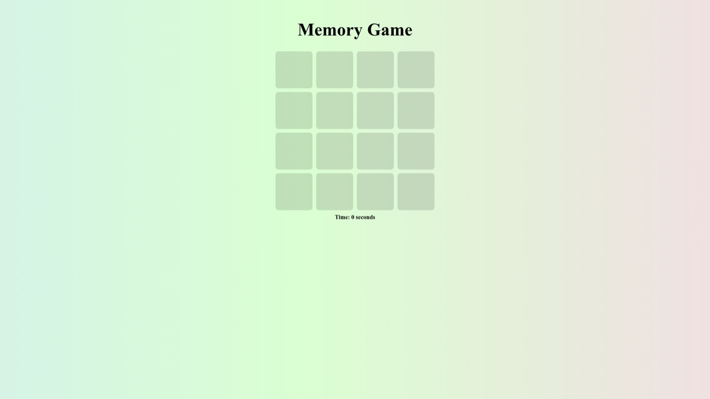

# Memory Match Game

**A classic card-matching game — find all the pairs in the fewest moves and the fastest time.**



**[Play it live →](https://anastacodes.github.io/MemoryMatchGame/)**

## Features

- Flip two cards at a time to reveal their hidden emoji
- Matched pairs stay face-up; misses flip back
- Move counter and timer track your performance
- End-of-game stats screen with one-click restart
- Built with vanilla HTML, CSS and JavaScript — no frameworks, no build step

## Run locally

```bash
git clone https://github.com/AnastaCodes/MemoryMatchGame.git
open MemoryMatchGame/index.html
```

## Acknowledgments

- Inspired by classic memory matching card games.
- Icons by [emoji.aranja](https://emoji.aranja.com/).
